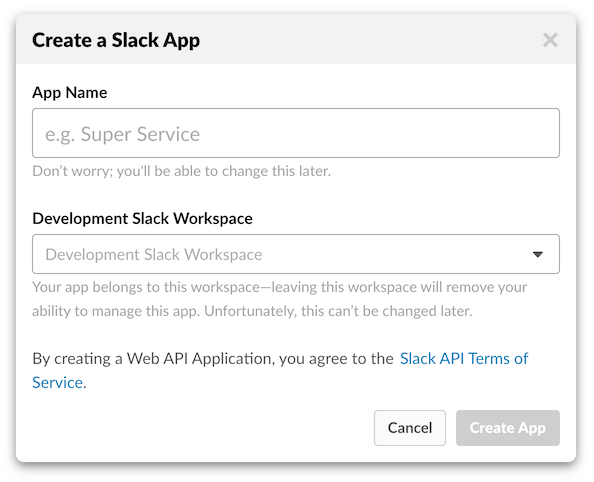
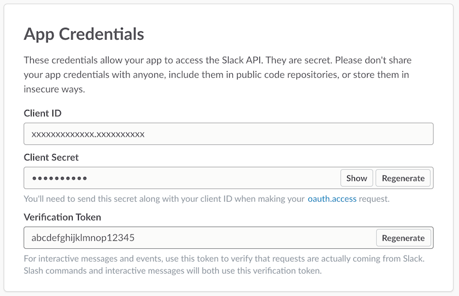
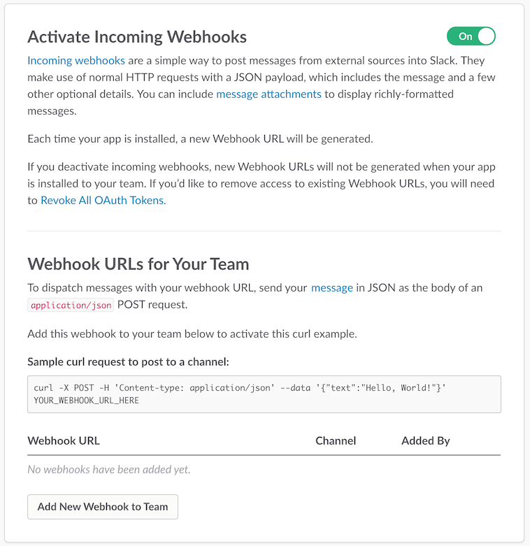
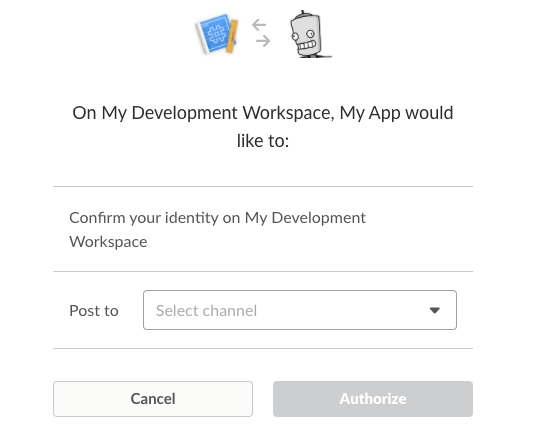
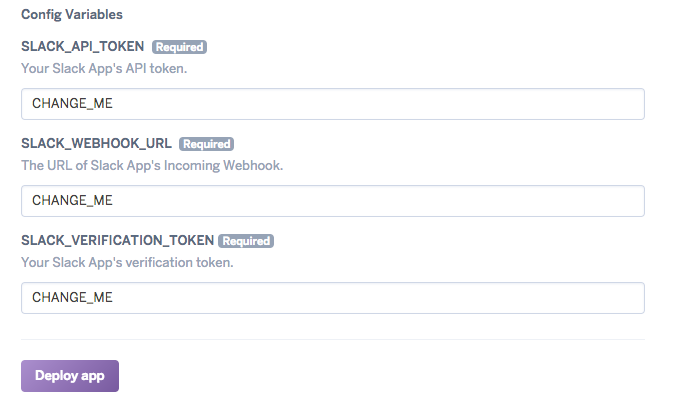
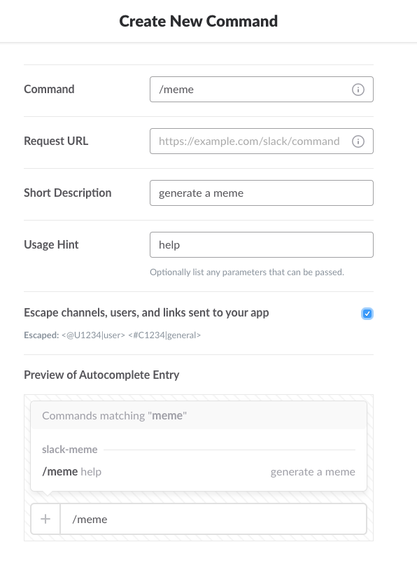

# slack-meme
Post memes to any of your Slack channels with a slash command.

## Usage

### Built-in Templates

`/meme success; we have; a meme bot;`


`/meme templates` shows you the available built-in templates:


### Custom Templates
Use your own image by passing its URL as the template:

`/meme https://nicolewhite.github.io/images/me.jpg; hello; my name is nicole;`


### Preview

Hone your meme skills privately by practicing in the slackbot channel.

### How It Works

The memes are posted under a bot in the same channel where `/meme` was called, where the bot's picture and username are replaced with your own. Because a bot is posting the meme and not you, you will not be able to delete memes once they are sent.

## Setup

### Slack App

1. Create a new Slack App at the [App creation page](https://api.slack.com/apps/new).

   

   Name your app with something easy to recognize, for example "Meme". If you are logged into more than one workspace, select one of them as the Development Slack Workspace.

2. Find your verification token and store it in an environment variable. On the Basic Information page, scroll down to find the "App Credentials" section.

   

   Copy the value in the "Verification Token" field, and store this value in the environment variable named `SLACK_VERIFICATION_TOKEN`. If you are going to run this app on the command line, its easy to do in your shell:

   ```
   $ export SLACK_VERIFICATION_TOKEN="replace with your token"
   ```

3. Create an Incoming Webhook and store the its URL in an environment variable. On the Incoming Webhooks page (under Features), slide the toggle to activate incoming webhooks. Click the button to add a new webhook.

   

   You'll be taken to a page to install your app in your workspace with the permissions required for the incoming webhook. Select a channel (it doesn't matter which one) and click Authorize.

   

   When you return to the Incoming Webhooks page, you'll find a new item in the table. Copy the Webhook URL and store it in another environment variable called `SLACK_WEBHOOK_URL`.

4. Find your API token and store it in an enviornment variable. On the Install App page you'll find an Oauth Access Token. This value is used as your API token. Copy it and store it in another environment variable called `SLACK_API_TOKEN`. **Leave the Slack App configuration open, you need to finish by adding the slash command below**.

### Deploy to Heroku

[Heroku](https://www.heroku.com/home) is the simplest platform to deploy your application onto. If you have your own hosting you can move onto the next section. If you're developing and running the application locally, at the very least you'll need a public URL where Slack can send requests and [ngrok](https://ngrok.com/) can be very useful for that.

If you don't aleady have an account with Heroku, sign up for free, then click the button:

[](https://heroku.com/deploy)

Paste your `SLACK_API_TOKEN`, `SLACK_WEBHOOK_URL`, and `SLACK_VERIFICATION_TOKEN` values into the appropriate config variables.



Click **Deploy app**. Once finished, the **App name** field will now be populated if you didn't choose a name upfront.

### Finish Slash Command Config

Go to the Slash Command configuration page (under Features). Create a new command and fill in the details.



The Request URL is the root URL for where you deployed the application. If you deployed to Heroku, the is `https://you-app-name.herokuapp.com` (replace with your own app name).

Save the Slash Command integration.

## Update Your Deployment

To update your deployment with changes from this repository, visit your app's homepage on Heroku and navigate to the section on deploying with Heroku git at https://dashboard.heroku.com/apps/your-app-name/deploy/heroku-git, replacing `your-app-name` with the name of your app. Follow the instructions there to get the Heroku toolbelt set up. Then:

```
$ heroku login
$ heroku git:clone -a your-app-name
$ cd your-app-name
```

Replace `your-app-name` with the name of your app. Once you have this set up, you can update your app with changes from this repository with the following:

```
$ git remote add slack-meme https://github.com/nicolewhite/slack-meme
$ git pull --rebase slack-meme master
$ git push heroku master
```

## Credits

This uses [memegen](https://github.com/jacebrowning/memegen). Thanks memegen!
